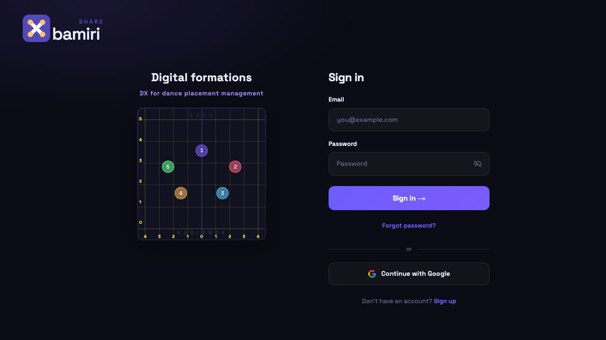
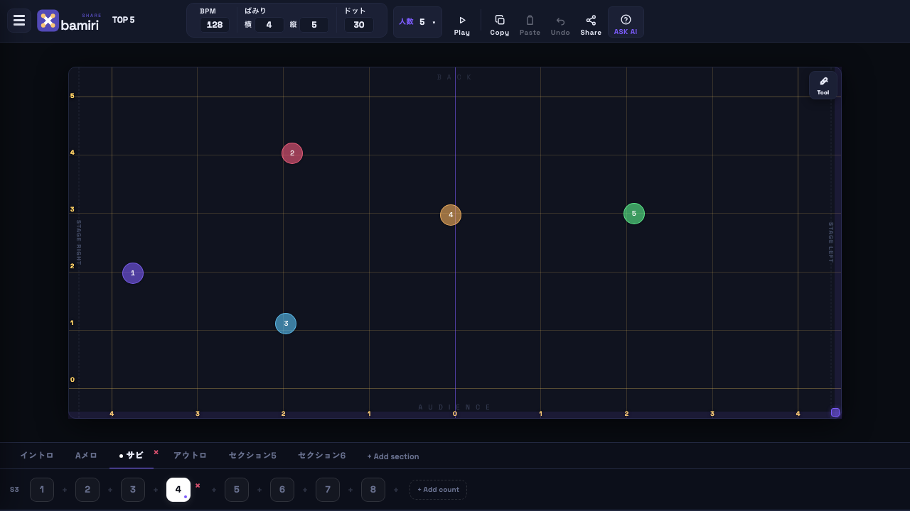

# bamiri — SHARE（choreo）

ダンスフォーメーション（配置）を **人数・空間・移動・BPM** で組み立てる Web アプリです。  
認証・クラウド同期・共有リンク・ASK AI（Gemini）・Stripe Pro 課金に対応しています。

**要件・非機能要件:** [`../CHOREO_要件定義書.md`](../CHOREO_要件定義書.md)（v2.1）  
**操作マニュアル:** [`docs/manual.ja.md`](docs/manual.ja.md) / [`docs/manual.en.md`](docs/manual.en.md)  
**設計書:** [`docs/design/README.md`](docs/design/README.md)（アーキテクチャ・ER・API・Figma 等）

**本番 URL（Vercel）:** [https://choreo-ten.vercel.app](https://choreo-ten.vercel.app)  
**CI:** [GitHub Actions](https://github.com/A-dance/choreo/actions)（lint・format・typecheck・UT・e2e・build）  
**API ドキュメント:** [`docs/design/api-spec.md`](docs/design/api-spec.md)（curl 例・OpenAPI・Postman）

> **画像の更新:** `npm run docs:capture` で本番 URL からログイン画面・エディター・再生 GIF を再取得します（デモワークスペースは `.env.local` がある場合に自動復元）。

## スクリーンショット

本番（`https://choreo-ten.vercel.app`）・デモアカウントで取得した最新キャプチャです。

| ログイン画面                                      | エディター（デモアカウント）                         |
| ------------------------------------------------- | ---------------------------------------------------- |
|  |  |

## デモ動画（GIF）

BPM 再生でカウントが進み、フォーメーションが切り替わる様子（本番デモ・デモアカウントで撮影）。


## 前提条件

| ツール      | バージョン                                              |
| ----------- | ------------------------------------------------------- |
| **Node.js** | **20 以上**（CI と `package.json` の `engines` と同じ） |
| **npm**     | 9 以上（`npm ci` / `npm install`）                      |
| ブラウザ    | Chromium / Safari 最新（モバイル・PC）                  |

任意: [Supabase](https://supabase.com/) プロジェクト（認証・同期・共有）、[Stripe](https://stripe.com/)（課金テスト）、[Google AI](https://ai.google.dev/) API キー（ASK AI）

## ローカルセットアップ

```bash
cd choreo
cp .env.example .env.local   # 値を編集
npm install
npm run dev
```

ブラウザで [http://localhost:3000](http://localhost:3000) を開きます。

```bash
npm run build        # 本番ビルド
npm run start        # 本番サーバー（ローカル）
npm test             # 単体・API テスト（Vitest）
npm run test:coverage
npm run test:e2e     # E2E（要 build 済み）。デモログインは E2E_DEMO_LOGIN=1 + .env.local
```

環境変数の一覧は [`.env.example`](.env.example) を参照してください。

### 環境変数（主要）

| 変数                            | 必須          | 用途                                   |
| ------------------------------- | ------------- | -------------------------------------- |
| `NEXT_PUBLIC_SUPABASE_URL`      | 本番・同期時  | Supabase プロジェクト URL              |
| `NEXT_PUBLIC_SUPABASE_ANON_KEY` | 本番・同期時  | クライアント用 anon キー               |
| `SUPABASE_SERVICE_ROLE_KEY`     | 本番・同期時  | サーバー API（共有・課金・削除）       |
| `NEXT_PUBLIC_APP_URL`           | 本番          | アプリの公開 URL（末尾スラッシュなし） |
| `GEMINI_API_KEY`                | ASK AI 利用時 | `POST /api/help`                       |
| `GEMINI_MODEL`                  | 任意          | 既定 `gemini-2.5-flash`                |
| `STRIPE_SECRET_KEY`             | 課金時        | Checkout / Portal / Webhook            |
| `STRIPE_PRO_PRICE_ID`           | 課金時        | Pro プラン Price ID                    |
| `STRIPE_WEBHOOK_SECRET`         | 課金時        | Webhook 署名検証                       |
| `SUPABASE_DB_URL`               | 任意          | `npm run supabase:setup` 用            |
| `E2E_DEMO_LOGIN`                | 任意          | E2E でデモログイン試験（`1`）          |

### Supabase 初回セットアップ（任意）

```bash
npm run supabase:setup    # schema.sql を SUPABASE_DB_URL へ適用
npm run demo:setup        # デモユーザー + ワークスペース投入
```

## 本番デプロイ（Vercel）

本番は **Vercel** に Git 連携デプロイしています（AWS ECS / Lambda / Fargate は未使用）。

| 項目                              | 値                                                    |
| --------------------------------- | ----------------------------------------------------- |
| **本番 URL**                      | https://choreo-ten.vercel.app                         |
| **`NEXT_PUBLIC_APP_URL`（本番）** | `https://choreo-ten.vercel.app`（末尾スラッシュなし） |

1. [Vercel](https://vercel.com/) で GitHub リポジトリ `A-dance/choreo` を Import
2. **Root Directory:** `choreo`（モノレポの場合はサブディレクトリを指定）
3. **Framework Preset:** Next.js（ビルド: `npm run build`、出力: デフォルト）
4. **Environment Variables** に [`.env.example`](.env.example) の本番用の値を設定
   - 必須: `NEXT_PUBLIC_SUPABASE_URL`, `NEXT_PUBLIC_SUPABASE_ANON_KEY`, `SUPABASE_SERVICE_ROLE_KEY`, `NEXT_PUBLIC_APP_URL`（本番は上表の URL）
   - 機能ごと: `GEMINI_API_KEY`, `STRIPE_*`（課金を使う場合）
5. `main` へ push で Production デプロイ（プレビューは PR ごと）

Stripe Webhook は `https://choreo-ten.vercel.app/api/stripe/webhook` を Stripe Dashboard に登録します（ドメイン変更時は URL を合わせて更新）。詳細は [`docs/design/api-spec.md`](docs/design/api-spec.md) を参照。

## AWS デプロイについて

| 項目                         | 本プロジェクト                                                                                    |
| ---------------------------- | ------------------------------------------------------------------------------------------------- |
| ECS / Fargate / Lambda / RDS | **未採用**                                                                                        |
| 代替構成                     | **Vercel**（フロント + API Routes）+ **Supabase**（Auth / DB / Storage）+ **Stripe** + **Gemini** |

根拠: [`docs/design/architecture.md`](docs/design/architecture.md) の「デプロイ構成（AWS 代替）」、[`docs/design/README.md`](docs/design/README.md) の N/A 一覧。

## デモアカウント

評価・動作確認用の固定アカウントです（ログイン画面に専用ボタンはありません）。

| 項目       | 値                                                    |
| ---------- | ----------------------------------------------------- |
| メール     | `demo@bamiri.share`                                   |
| パスワード | `Demo1234`                                            |
| プラン     | **Pro**（複数プロジェクト・フォルダー共有を試せます） |

`/login` から上記でログインすると、フォルダー「デモセット」内の「サンプル（参考）」「サンプル B」と、その他フォルダーの「その他の曲」が読み込まれます。Free プランの挙動を試す場合はマイページの Stripe Portal で解約するか、`DEMO_PLAN=free npm run demo:user` でプランを戻してください。

Supabase の環境変数（`.env.local`）が設定済みのとき、デモユーザーとデータを再作成するには:

```bash
npm run demo:setup
```

（`demo:user` でアカウント作成、`demo:workspace` でワークスペース投入）

## 外部 API・サービス

| サービス                           | 用途                                                    | 設定（環境変数）                                                    |
| ---------------------------------- | ------------------------------------------------------- | ------------------------------------------------------------------- |
| **Supabase**                       | 認証・プロフィール・ワークスペース JSON・共有ストレージ | `NEXT_PUBLIC_SUPABASE_*`, `SUPABASE_SERVICE_ROLE_KEY`               |
| **Stripe**                         | Pro サブスクリプション（Checkout / Portal / Webhook）   | `STRIPE_SECRET_KEY`, `STRIPE_PRO_PRICE_ID`, `STRIPE_WEBHOOK_SECRET` |
| **Google Gemini**                  | ASK AI（`POST /api/help`）                              | `GEMINI_API_KEY`, `GEMINI_MODEL`                                    |
| Spotify / Apple Music / YouTube 等 | 音源リンクのメタデータ取得（`GET /api/music-metadata`） | クライアントから URL を渡すのみ（API キー不要）                     |

REST エンドポイント一覧・curl 例: [`docs/design/api-spec.md`](docs/design/api-spec.md)

## 主要 API エンドポイント

| メソッド | パス                       | 機能                                               |
| -------- | -------------------------- | -------------------------------------------------- |
| `POST`   | `/api/share`               | 共有スナップショット作成（1 曲 or フォルダー単位） |
| `GET`    | `/api/share?id=`           | 共有データ取得（閲覧専用）                         |
| `POST`   | `/api/share/upload-url`    | 共有用メディアのアップロード URL                   |
| `POST`   | `/api/help`                | ASK AI（Gemini）質問応答                           |
| `GET`    | `/api/music-metadata?url=` | 音源 URL のメタデータ取得                          |
| `POST`   | `/api/account/delete`      | アカウント削除（Bearer JWT）                       |
| `POST`   | `/api/stripe/checkout`     | Pro 申込 Checkout セッション                       |
| `POST`   | `/api/stripe/portal`       | Stripe 顧客ポータル                                |
| `GET`    | `/api/stripe/subscription` | サブスクリプション状態                             |
| `POST`   | `/api/stripe/sync`         | 課金状態の同期                                     |
| `POST`   | `/api/stripe/webhook`      | Stripe Webhook                                     |

## 将来実装予定

現バージョンでは **要件定義のスコープ外**（共同編集・PDF 出力等）は [`CHOREO_要件定義書.md`](../CHOREO_要件定義書.md) §1.4 を参照。

運用・品質まわりで検討中の拡張（[`docs/design/logging.md`](docs/design/logging.md) より）:

- 構造化ログ（`{ level, route, error, userId }`）
- Sentry 等のエラートラッキング
- リクエスト ID（`X-Request-Id`）の付与

## 画面構成

```
┌ SmartHeader ────────────────────────────────────────────────┐
│ ≡ / 曲名 / BPM・Grid・Dots / 人数 / Play・Copy・Paste・Undo │
│ Share / ASK AI                                              │
├ StageArea ──────────────────────────────────────────────────┤
│  ステージ（メンバー配置・D&D）  右上: Tool（描画ツール）     │
├ TimelineFooter ─────────────────────────────────────────────┤
│  セクションタブ / カウント行（選択時に赤い × で削除）        │
└─────────────────────────────────────────────────────────────┘
  サイドバー（≡）: PROJECTS・検索・新規・フォルダー・音源・動画
```

| 領域       | コンポーネント   | 役割                                                  |
| ---------- | ---------------- | ----------------------------------------------------- |
| 上部       | `SmartHeader`    | 曲名・BPM/Grid/Dots・人数・再生・コピペ・共有・ASK AI |
| 中央       | `StageArea`      | ステージ・メンバー配置・描画ツール（Tool）            |
| 下部       | `TimelineFooter` | セクションタブ・カウント操作                          |
| サイドバー | `ProjectSidebar` | プロジェクト・フォルダー・検索・音源・参考動画        |
| 共通       | `MemberPanel`    | メンバー名・表示/非表示・削除                         |
| 共通       | `HelpPanel`      | ASK AI チャット                                       |
| 状態       | `ChoreoContext`  | 編集状態・再生・localStorage / クラウド同期           |

## 主な機能

### 認証・アカウント

- メール / Google ログイン、新規登録、パスワード再設定
- **マイページ** … 表示名・アバター・言語・プラン・Stripe Portal
- ログイン時 **クラウド同期**（無料・Pro 共通）

### プロジェクト・フォルダー（サイドバー）

- **PROJECTS** 見出し、**検索…**、**+ 新規プロジェクト**、**フォルダー** ボタン
- ブックマーク / フォルダー / その他 のブロック表示
- ドラッグで並べ替え・フォルダー移動
- プロジェクト名のダブルクリックでリネーム

> **ページネーション:** プロジェクト一覧はサイドバーに全件表示します。件数は Free 1 件 / Pro 無制限と少なく、**ページ分割 UI は要件外（N/A）** です。

### フォーメーション編集

- メンバーをドラッグ＆ドロップで配置（方眼スナップ）
- カウント切替時に滑らかにアニメーション
- **Copy** / **Paste** / **Undo**（⌘C / ⌘V / ⌘Z）

### ヘッダーツール

- **BPM**（40〜240）、**Grid** 横/縦（ばみり）、**Dots** サイズ（14〜64 px）
- ラベル・数値は **Play** ボタンと同系の明るい表示

### タイムライン

- セクション（イントロ / Aメロ / サビ 等）のタブ・並べ替え
- セクション名は **ダブルクリック** で編集
- **選択中のセクション**に赤い **×** → 確認後にセクション削除（2 件以上・再生中は非表示）
- カウントの **クリック** で移動・選択
- **選択中のカウント**に赤い **×** → **必ず確認**して削除（再生中は非表示）
- **+** で半カウント（&）挿入、**+ Add count** / **+ Add section**

### BPM 再生

- **Play** または **Space** で再生 / 一時停止
- BPM に合わせてカウント自動進行
- 再生中にカウントクリックでその位置から再開

### ステージ描画（Tool）

- ステージ右上 **Tool** … 矢印・×マーク・ペン（カウントごとに保存）
- アイコンは最初から明るく表示、ホバーで背景が色づく（Play と同様）
- 閲覧専用モードでは非表示

### メンバー管理

- **人数** パネルで人数・名前・表示/非表示・リストから削除

### 共有（Share）

- 1 曲またはフォルダー単位の共有リンク
- 閲覧専用プレビュー

### ASK AI

- ヘッダー **ASK AI** … 操作マニュアルに基づくチャット（Gemini）
- 閲覧専用モードでは利用不可

### メディア

- サイドバー **音源** … Smart link（Spotify 等・ファイル便 URL も登録可）
- **参考動画** … YouTube / Vimeo

### 課金（Pro）

- 無料: プロジェクト 1 件 / Pro: 無制限（Stripe）

### 保存

- 編集内容は **自動保存**（localStorage + ログイン時クラウド）

## キーボードショートカット

詳細は [`docs/manual.ja.md`](docs/manual.ja.md) §11 を参照。

| 操作                       | キー                                         |
| -------------------------- | -------------------------------------------- |
| 前のカウント               | `←` / `[`                                    |
| 次のカウント               | `→` / `]`                                    |
| 再生 / 停止                | `Space`                                      |
| 配置コピー                 | `⌘C` / `Ctrl+C`                              |
| 配置ペースト               | `⌘V` / `Ctrl+V`                              |
| 元に戻す（Undo）           | `⌘Z` / `Ctrl+Z`                              |
| メンバー選択時: 非表示     | `Delete` / `Backspace`                       |
| 未選択時: 現在カウント削除 | `Delete` / `Backspace`（データあり時は確認） |
| 選択解除 / 再生停止        | `Esc`                                        |

## プロジェクト構成

```
choreo/
├── src/
│   ├── app/                 # Next.js App Router
│   │   ├── layout.tsx
│   │   ├── page.tsx
│   │   └── globals.css
│   ├── components/
│   │   ├── ChoreoApp.tsx    # シェル（Header + Stage + Footer）
│   │   ├── SmartHeader.tsx
│   │   ├── StageArea.tsx
│   │   ├── StageFloor.tsx   # 方眼・ばみり番号
│   │   ├── TimelineFooter.tsx
│   │   ├── MemberPanel.tsx
│   │   ├── KeyboardShortcuts.tsx
│   │   └── Toast.tsx
│   ├── context/
│   │   └── ChoreoContext.tsx
│   └── lib/
│       ├── types.ts
│       ├── constants.ts
│       ├── choreoUtils.ts   # 配置・再生・永続化
│       ├── sectionUtils.ts  # セクション・＆スロット
│       └── gridUtils.ts     # 方眼・ステージサイズ
└── package.json
```

## データモデル（概要）

```typescript
ChoreoState {
  songTitle: string
  sections: Section[]       // 各セクションに count / & スロット
  members: Member[]
  removedMembers: Member[]  // 削除済み（復元用）
  bpm: number
  currentCount: number      // グローバルスロット index（1 始まり）
  countData: Record<number, CountData>
  stage: { bamiriHalfWidth, bamiriDepth, scaleW, scaleH }
}
```

## 技術スタック

| 区分           | 採用技術                                                            |
| -------------- | ------------------------------------------------------------------- |
| フレームワーク | **Next.js 16**（App Router）、**React 19**、**TypeScript 5**        |
| スタイル       | Tailwind CSS 4 + カスタム CSS（`globals.css`）                      |
| 認証・DB       | **Supabase**（Auth / PostgreSQL / Storage）                         |
| 課金           | **Stripe**（Checkout / Customer Portal / Webhook）                  |
| AI             | **Google Gemini**（`@google/generative-ai` 相当、`POST /api/help`） |
| 状態           | `ChoreoContext`、localStorage、IndexedDB（メディア）                |
| テスト         | **Vitest**（単体・API）、**Playwright**（e2e）                      |
| CI             | GitHub Actions                                                      |
| ホスティング   | **Vercel**（本番）                                                  |

主要依存: `next`, `react`, `@supabase/supabase-js`, `stripe` — 詳細は [`package.json`](package.json)

## レガシー

- `../choreo_prototype.html` … 初期プロトタイプ（単体 HTML）
- `../CHOREO_要件定義書.md` … 要件定義書（Markdown・エディタで読める）
- `../CHOREO_要件定義書.docx` … 要件定義書（Word 用。Cursor では文字化けするので MD を参照）

### 要件定義書（.docx）の再生成

プロジェクトルートで:

```bash
cd ..   # choreo/ から上へ
.venv/bin/python gen_requirements.py
```

初回のみ venv が無い場合:

```bash
python3 -m venv .venv
.venv/bin/pip install python-docx
.venv/bin/python gen_requirements.py
```
