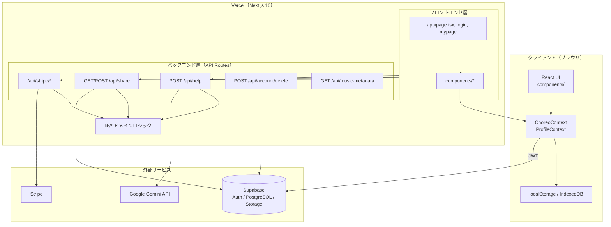
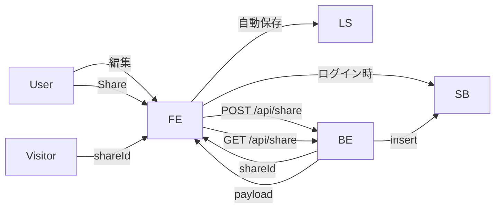

# アーキテクチャ設計・フロントエンド / バックエンド分離

## 1. 全体構成図

## 2. フロントエンド / バックエンド分離方針

本プロジェクトは **Next.js モノリス** だが、責務は明確に分離している。

| 層 | ディレクトリ | 責務 | 実行環境 |
|----|-------------|------|----------|
| **フロントエンド** | `src/components/`, `src/context/`, `src/app/**/page.tsx` | UI 描画・ユーザー操作・クライアント状態 | ブラウザ（CSR） |
| **バックエンド** | `src/app/api/**/route.ts` | 認証検証・外部 API 呼び出し・DB 書き込み | Node.js（サーバー） |
| **共有ドメイン** | `src/lib/` | 型定義・ビジネスロジック・バリデーション | FE/BE 両方から import |

### 分離ルール

1. **秘密鍵はバックエンドのみ** — `GEMINI_API_KEY`, `STRIPE_SECRET_KEY`, `SUPABASE_SERVICE_ROLE_KEY` は `route.ts` / `lib/*Server.ts` のみ
2. **DB 直接書き込みは API 経由** — クライアントは Supabase Anon Key + RLS で本人データのみ。共有作成は Service Role
3. **UI は API クライアント** — `fetch('/api/...')` でバックエンドを呼び出す
4. **オフライン編集** — フロントエンドが `localStorage` を正とし、ログイン時にクラウドへ同期

## 3. デプロイ構成（AWS 代替）

| コンポーネント | サービス | 役割 |
|---------------|----------|------|
| CDN + SSR/API | Vercel | Next.js ホスティング |
| RDB + Auth | Supabase PostgreSQL | ユーザーデータ・共有 |
| オブジェクト | Supabase Storage | アバター・共有メディア |
| 決済 | Stripe | Checkout / Portal / Webhook |
| LLM | Google AI (Gemini) | ASK AI |

> AWS（ECS / Lambda / RDS / VPC）は採用しない。上記マネージド構成を [architecture.md](./architecture.md) で代替とする。

## 4. データフロー概要

