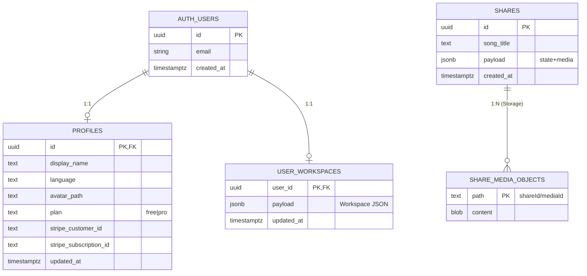

# ER 図（エンティティ関連図）

データベース: **Supabase PostgreSQL** + **Supabase Auth** + **Storage**

## ER 図

## Storage バケット

| バケット | 公開 | 用途 | RLS |
|----------|------|------|-----|
| `avatars` | 非公開 | ユーザーアバター | 本人のみ read/write |
| `share-media` | 公開 read | 共有用メディアファイル | 公開 read のみ |

## クライアント側（非 RDB）

| 保存先 | 内容 |
|--------|------|
| `localStorage` (`choreo-v3-workspace`) | ワークスペース全体（オフライン正本） |
| IndexedDB | ローカルアップロード音源・動画 blob |

## DDL 参照

- [`../../supabase/schema.sql`](../../supabase/schema.sql)
- [`../../supabase/auth_schema.sql`](../../supabase/auth_schema.sql)
- テーブル定義の詳細: [table-definitions.md](./table-definitions.md)
