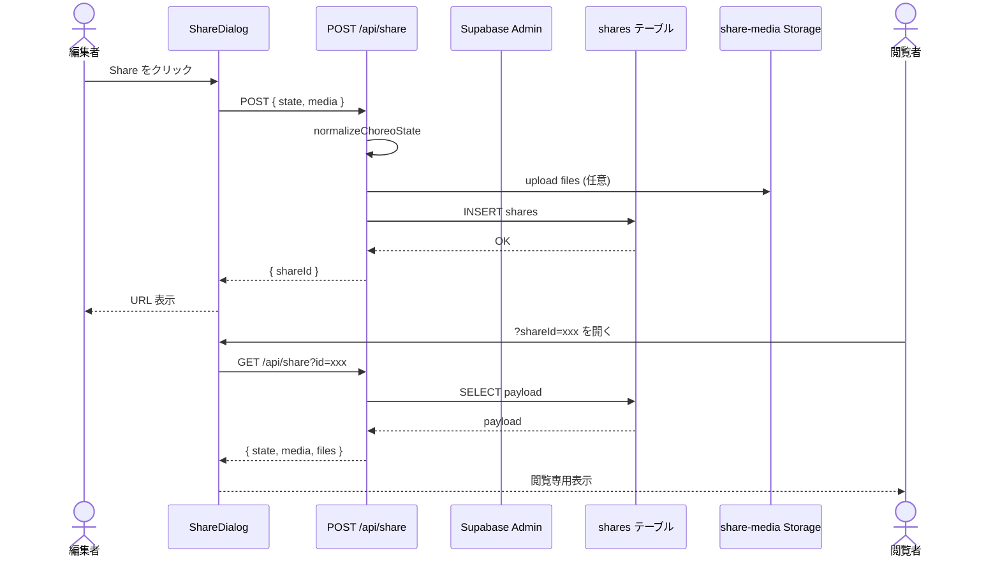
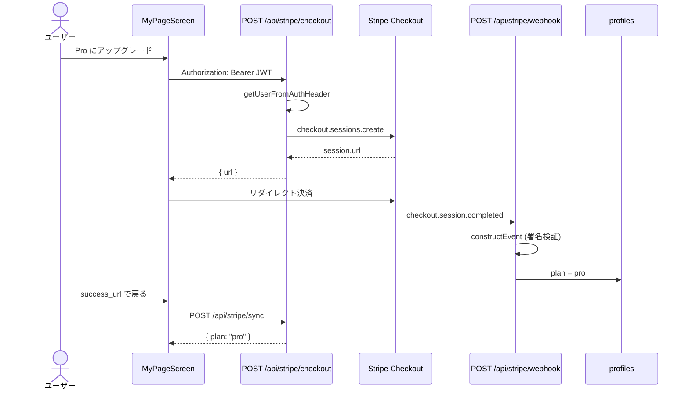
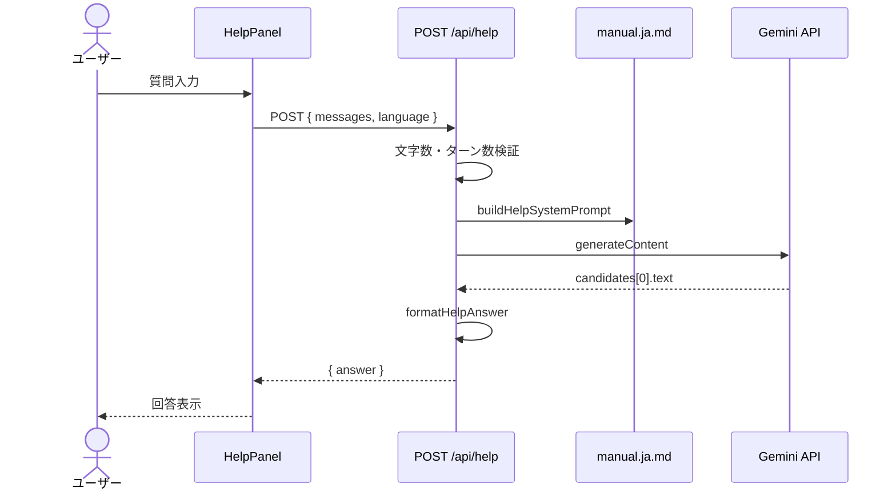
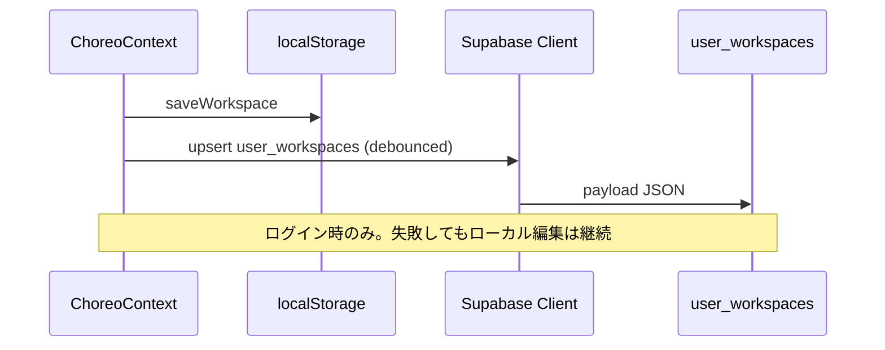

# シーケンス図

複雑フロー 3 本: **共有リンク作成**、**Stripe 課金**、**ASK AI**

---

## 1. 共有リンク作成・閲覧

```mermaid
sequenceDiagram
  actor User as 編集者
  participant UI as ShareDialog
  participant API as POST /api/share
  participant Admin as Supabase Admin
  participant DB as shares テーブル
  participant Store as share-media Storage
  actor Visitor as 閲覧者

  User->>UI: Share をクリック
  UI->>API: POST { state, media }
  API->>API: normalizeChoreoState
  API->>Store: upload files (任意)
  API->>DB: INSERT shares
  DB-->>API: OK
  API-->>UI: { shareId }
  UI-->>User: URL 表示

  Visitor->>UI: ?shareId=xxx を開く
  UI->>API: GET /api/share?id=xxx
  API->>DB: SELECT payload
  DB-->>API: payload
  API-->>UI: { state, media, files }
  UI-->>Visitor: 閲覧専用表示
```

---

## 2. Stripe Pro 申込・プラン同期

```mermaid
sequenceDiagram
  actor User as ユーザー
  participant MP as MyPageScreen
  participant API as POST /api/stripe/checkout
  participant Stripe as Stripe Checkout
  participant WH as POST /api/stripe/webhook
  participant DB as profiles

  User->>MP: Pro にアップグレード
  MP->>API: Authorization: Bearer JWT
  API->>API: getUserFromAuthHeader
  API->>Stripe: checkout.sessions.create
  Stripe-->>API: session.url
  API-->>MP: { url }
  MP->>Stripe: リダイレクト決済
  Stripe->>WH: checkout.session.completed
  WH->>WH: constructEvent (署名検証)
  WH->>DB: plan = pro
  User->>MP: success_url で戻る
  MP->>API: POST /api/stripe/sync
  API-->>MP: { plan: "pro" }
```

---

## 3. ASK AI（Gemini ヘルプ）

```mermaid
sequenceDiagram
  actor User as ユーザー
  participant HP as HelpPanel
  participant API as POST /api/help
  participant Manual as manual.ja.md
  participant Gemini as Gemini API

  User->>HP: 質問入力
  HP->>API: POST { messages, language }
  API->>API: 文字数・ターン数検証
  API->>Manual: buildHelpSystemPrompt
  API->>Gemini: generateContent
  Gemini-->>API: candidates[0].text
  API->>API: formatHelpAnswer
  API-->>HP: { answer }
  HP-->>User: 回答表示
```

---

## 4. クラウド同期（参考）

```mermaid
sequenceDiagram
  participant CTX as ChoreoContext
  participant LS as localStorage
  participant SB as Supabase Client
  participant DB as user_workspaces

  CTX->>LS: saveWorkspace
  CTX->>SB: upsert user_workspaces (debounced)
  SB->>DB: payload JSON
  Note over CTX,DB: ログイン時のみ。失敗してもローカル編集は継続
```
